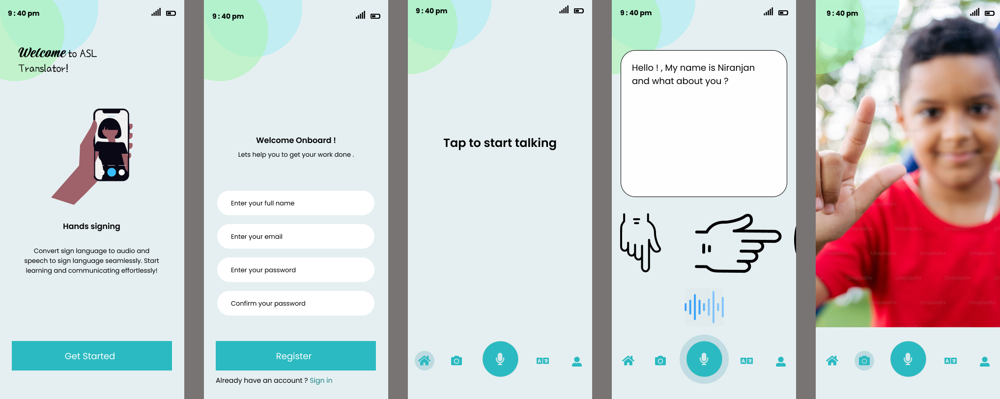

# sign-language-translator
Real-time sign language translation android app using AI. Converts sign gestures to speech and vice versa for seamless communication.
# Real-Time Sign Language Translator UI  
This repository contains the UI code for our Android app.

## 📌 Features  
- Interactive UI for sign language translation  
- Intuitive design for easy communication  

## 📂 Folder Structure  
- `src/` → Contains all UI source code (XML/Jetpack Compose)  
- `doc/` → Includes UI screenshots and design documentation  
- `README.md` → Overview of the project  

## 📸 UI Screenshots  
 

