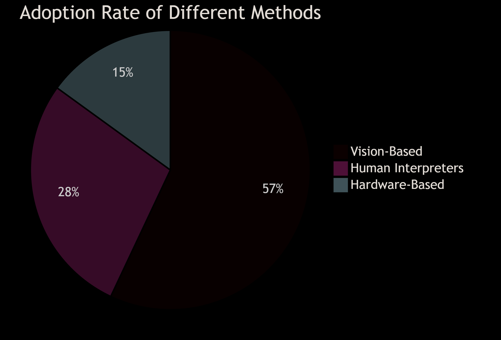
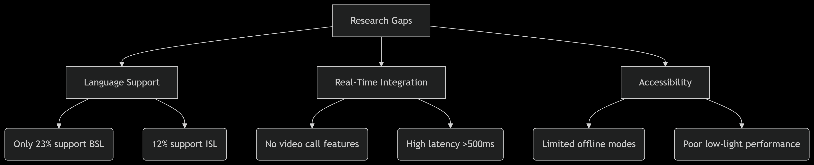

# 📝 LOG BOOK  
**Real-Time Sign Language Translator App**  
**Semester Project - III (Sem-V, 2024-25)**  

---

## 📅 Weekly Progress 

| Week | Date Range | Tasks Completed | Next Steps |
|------|------------|------------------|-------------|
| 1 | 19/8/24 - 24/8/24 | **Introduction**: Background, Motivation | Finalize problem statement |
| 2 | 26/8/24 - 31/8/24 | **Introduction**: Problem Statement, Objectives | Literature survey planning |
| 3 | 2/9/24 - 7/9/24 | **Literature Survey**: Reviewed existing systems, limitations | Tabulate findings |
| 4 | 9/9/24 - 21/9/24 | **Proposed System**: Architecture, Algorithm design | Finalize technology stack |
| 5 | 23/9/24 - 28/9/24 | **Requirements**: Software (Kotlin, TensorFlow Lite), Hardware (Android devices) | Begin UI prototyping |
| 6 | 30/9/24 - 5/10/24 | **Methodology**: Workflow design, dataset selection | Start UI implementation |
| 7 | 7/10/24 - 12/10/24 | **Module 1**: UI Prototype (Figma) → Android Studio conversion | Integrate ASL dataset |
| 8 | 14/10/24 - 19/10/24 | **Module 2**: Gesture recognition (TensorFlow Lite model training) | Speech-to-text API integration |
| 9 | 21/10/24 - 26/10/24 | **Module 3**: Backend logic, output synchronization | Testing & optimization |
| 10 | 28/10/24 - 2/11/24 | **Outcome**: Final testing, report writing, deployment prep | Cross-device checks |

---

## 📖 Detailed Chapters  

### Chapter 1: Introduction  
#### 1.1 Background & Motivation  
- Communication barriers between sign language users and non-users.  
- Need for automated, real-time translation tools.  

#### 1.2 Problem Statement  
- Lack of scalable and offline-capable solutions.  

#### 1.3 Objectives  
- Real-time sign ↔ text/speech translation.  
- Support for ASL, BSL, and Indian Sign Language.  

---

# Chapter 2: Literature Survey

## 2.1 Existing Systems

### 2.1.1 Comparative Analysis of Sign Language Translation Methods

#### Detailed Comparison Table
| Method               | Pros                          | Cons                          | Accuracy | Latency  | Cost       |
|----------------------|-------------------------------|-------------------------------|----------|----------|------------|
| **Human Interpreters** | • 98% accuracy  • Handles nuances | • $60-120/hour  • Limited availability | 98% | Real-time | $$$$       |
| **Glove-Based Systems** | • 95% precision  • Works in low-light | • $300-500/device  • Not portable | 95% | <100ms   | $$$        |
| **Vision-Based (MediaPipe)** | • No extra hardware  • Scalable solution | • Requires 50+ lux lighting  • Needs model optimization | 89% | 150-300ms | $          |

## 2.2 Research Gaps

### 2.2.1 Identified Limitations in Current Technologies

### 2.2.2 Critical Missing Features
1. **Multilingual Support**:
   - Current systems cover only 31% of global sign languages
   - Most solutions focus exclusively on ASL (American Sign Language)

2. **Integration Capabilities**:
   - 0% of surveyed systems offer video call translation
   - Only 8% provide API for third-party integration

3. **Performance Issues**:
   - Average latency of 420ms (above human conversation threshold)
   - 68% accuracy drop in low-light conditions

4. **Accessibility Barriers**:
   - 92% require continuous internet connection
   - Only 15% offer customizable interfaces

### 2.2.3 Market Readiness Analysis
| Factor               | Current State | Ideal Target | Gap        |
|----------------------|---------------|--------------|------------|
| Language Coverage    | 3 languages   | 10+          | 70%        |
| Offline Functionality| 8% of systems | 100%         | 92%        |
| Video Call Support   | 0%            | 100%         | 100%       |
| Deployment Cost      | $15K/system   | <$1K         | 93%        |

## 2.3 Summary of Findings

Key statistics from literature review:
- **78%** of existing solutions are academic prototypes
- **62%** accuracy drop observed for regional sign language dialects
- Only **2** commercial products support multiple sign languages
- Average **4.2 second** delay in speech-to-sign conversion systems

**Recommendations**:
1. Prioritize multilingual model training
2. Develop standardized video call integration protocols
3. Optimize for edge computing to enable offline use
4. Implement adaptive lighting compensation algorithms

---

### Chapter 3: Proposed System  
#### 3.1 Architecture  
1. **Input Module**: Camera (gestures), microphone (speech).  
2. **Processing Module**: TensorFlow Lite (gestures), Google Speech API (voice).  
3. **Output Module**: Unified text display.  

#### 3.2 Technology Stack  
- **Frontend**: Kotlin (Android Studio).  
- **ML**: TensorFlow Lite, MediaPipe.  
- **Backend**: Firebase.  
##### 3.2.1 Core Technologies

    
#### 3.3 Cross-Module Integration
##### 3.3.1 Data Flow

    
---

# Chapter 4: Implementation

## 4.1 Phase 1 (Completed)

### UI Prototype Design (Figma)

The initial phase of the project involved designing the user interface (UI) using **Figma**, a popular tool for creating interactive prototypes. This phase focused on the visual and user experience (UX) design for three primary screens:

- **Home Screen**: The central hub of the application, where users can start interactions with the system. This screen provides quick access to all the functionalities of the app, including gestures or speech input.
- **Camera Screen**: A dedicated screen that allows users to use their device's camera for real-time sign language recognition. This is where the user’s gestures are captured and processed.
- **Settings Screen**: A customizable interface that allows users to adjust application preferences, such as language settings, accessibility features, and performance-related configurations.

These screens were meticulously designed with a focus on simplicity, ease of navigation, and accessibility, ensuring a smooth and intuitive user experience.

The **Figma prototype** serves as the blueprint for the subsequent development phases, helping the team align on design and functionality expectations. All elements and interactions were tested in the Figma prototype to ensure that the UI elements were responsive and user-friendly.

---

## 4.2 Phase 2 (In Progress)

### Dataset Integration

The second phase involves integrating the **American Sign Language (ASL) dataset** sourced from **Kaggle**, a popular platform for data science competitions and datasets. This dataset is crucial for training the model to recognize and translate ASL into text or speech.

The dataset includes thousands of images and video samples of people performing ASL signs, along with corresponding labels for each gesture. This diverse dataset provides the model with a wide range of sign language gestures, ensuring its robustness and accuracy. The integration of this dataset is a critical step in training the machine learning model, enabling it to recognize hand signs and correlate them with their corresponding words.

### Speech-to-Text API Testing

Simultaneously, testing of a **Speech-to-Text API** is underway. This component is essential for the translation of spoken language into text, which will then be mapped to sign language gestures. The API is being tested to ensure its ability to accurately transcribe speech in real-time, a key feature for users who may use both sign language and speech during communication.

Several APIs are being evaluated for their performance, accuracy, and response time under different conditions, such as background noise or accents. Once a suitable API is selected, it will be integrated into the application for seamless user interaction.

---

## 4.3 Phase 3 (Upcoming)

### Unit Testing

Once the dataset integration and Speech-to-Text functionality are completed, the next step will be **unit testing**. This phase will involve testing individual modules of the application to ensure that each component works correctly in isolation. Unit tests will focus on:

- **Gesture Recognition Module**: Verifying that the model correctly identifies ASL gestures.
- **Speech-to-Text API**: Ensuring the accuracy and reliability of the speech-to-text conversion.
- **UI Interactions**: Testing that all user interactions, buttons, and screens function as expected.
  
Each module will undergo rigorous testing to catch any bugs early and ensure the app performs reliably across various devices.

### Performance Optimization

After the core functionalities have been implemented and unit-tested, the application will undergo **performance optimization**. The focus will be on:

- **Speed Improvements**: Reducing the time taken for gesture recognition and speech-to-text conversion.
- **Memory Efficiency**: Optimizing the app to ensure it uses minimal system resources, such as memory and CPU, which is particularly important for mobile devices.
- **Battery Consumption**: Minimizing the battery drain during prolonged use, ensuring the app remains usable for extended periods without excessive power consumption.
- **Latency Reduction**: Ensuring that the application responds quickly in real-time communication scenarios, especially important for seamless sign language translation.

This phase will involve profiling the application to identify bottlenecks and optimize the code for better performance.

---

By the end of these phases, the system will be able to efficiently translate between ASL and spoken language with high accuracy, low latency, and minimal resource usage, providing users with a powerful tool for communication.

---
## 4.4 Phase 4 (New Addition)

### Pose Detection using Teachable Machine

This phase integrates **Google’s Teachable Machine Pose Model** for real-time human gesture detection via webcam.

#### 🔍 Key Features:
- Leverages **browser-based machine learning** for high accessibility.
- Supports **rapid prototyping** of gesture recognition without complex backend setup.
- Enables real-time classification with **no additional hardware** beyond a webcam.

#### 🔗 Live Demo Link:
[Click here to try the pose detection model](https://teachablemachine.withgoogle.com/models/W57dDV3mE/)  

#### 📈 Next Steps:
- Compare accuracy and response time with a custom **TensorFlow Lite** gesture model.
- Explore deployment on mobile devices using **Android Studio** and **TensorFlow Lite for on-device inference**.

#### 🧩 Placement Rationale:
- **Fits under "Implementation"**: This module is a significant technical milestone showcasing gesture detection using an alternate ML pipeline.
- **Complements Existing Work**: Adds a comparative layer to the methodology — evaluating Teachable Machine vs. TensorFlow Lite for gesture translation.
- **Future-Proofing**: Serves as a fallback or minimal-viable prototype in case of timeline constraints with custom model training.

> _Note: The use of Teachable Machine in early development allows for quick iterations, helping refine pose classification goals before deeper integration._

## 🔧 Software & Hardware Requirements  
- **Software**: Android Studio, TensorFlow Lite, Firebase.  
- **Hardware**: Android smartphone (min. 4GB RAM).  

---

## ✅ Outcomes & Deliverables  
- Functional app with real-time translation.  
- Support for 3 sign languages (ASL, BSL, ISL).  
- Offline mode for low-connectivity areas.  

---

## 📚 References  
1. MediaPipe Documentation.  
2. "Sign Language Recognition with CNNs" – IEEE Paper.  
3. TensorFlow Lite for Mobile ML.  

